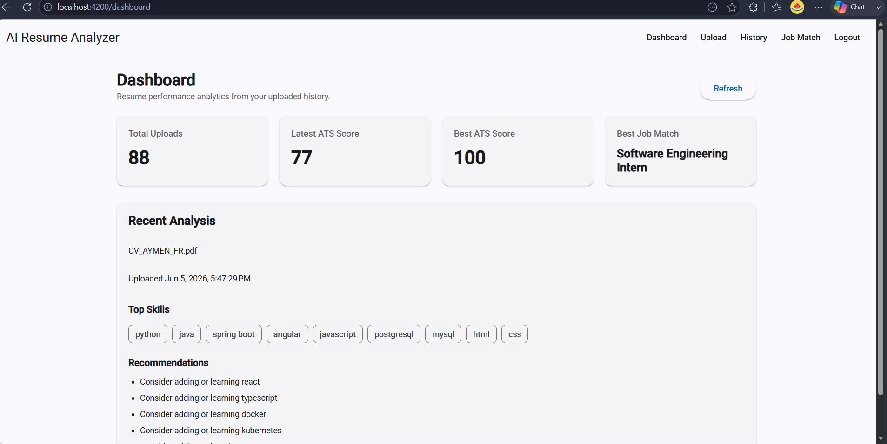
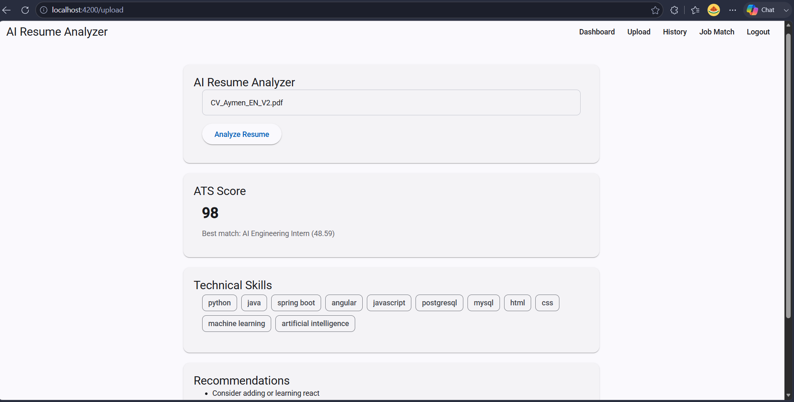
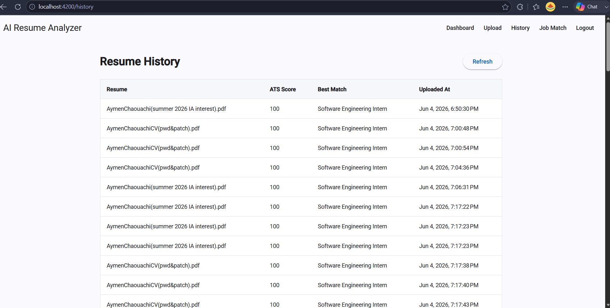
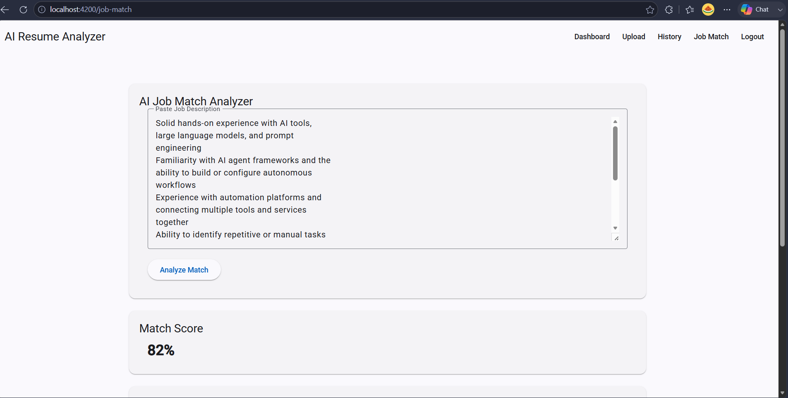
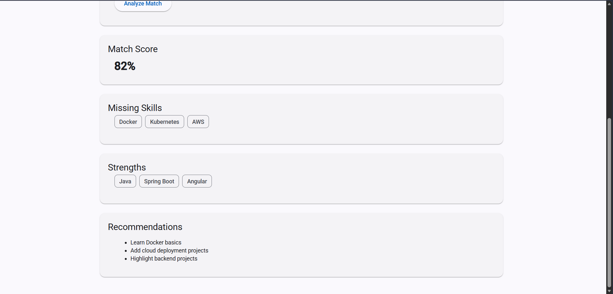
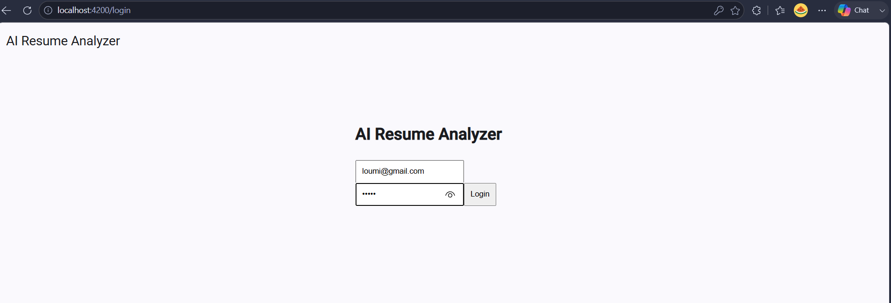

# AI Resume Analyzer

AI-powered career assistant platform that analyzes resumes, tracks ATS performance, and compares resumes against job descriptions using AI.

---

## Features

- JWT Authentication
- Resume Upload & Storage
- AI Resume Analysis
- ATS Score Evaluation
- Resume History Tracking
- Dynamic Dashboard Analytics
- Job Description Matching
- Angular Material UI
- PostgreSQL Persistence

---

## Tech Stack

### Frontend
- Angular
- Angular Material
- TypeScript

### Backend
- Spring Boot
- Spring Security
- JWT Authentication
- JPA / Hibernate

### Database
- PostgreSQL

### AI Integration
- Python AI service

---

## Screenshots

### Dashboard

---

### Resume Upload & AI Analysis

---

### Resume History

---

### Job Match Analyzer

---

### Authentication

---

## Installation

### Backend

cd backend-spring 
./mvnw spring-boot:run

---

### Frontend

cd frontend-angular 
npm install 
ng serve

---
 
### Future Improvements

PDF export.  
Real LLM semantic matching.  
Dark mode.  
Resume version comparison.  
Recruiter dashboard.  